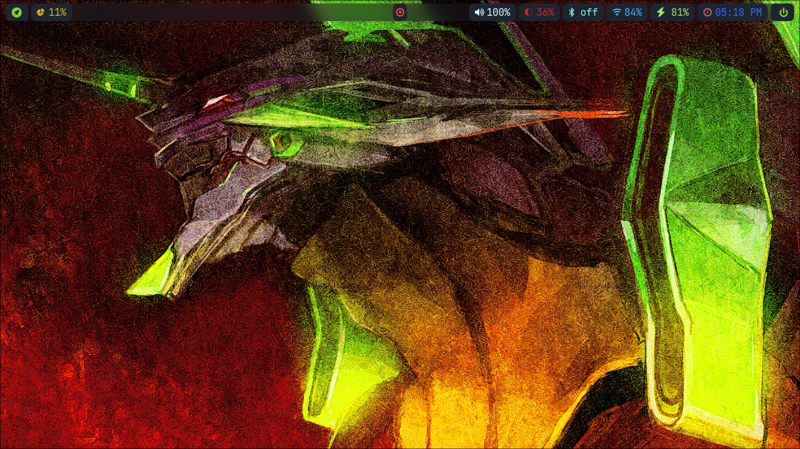
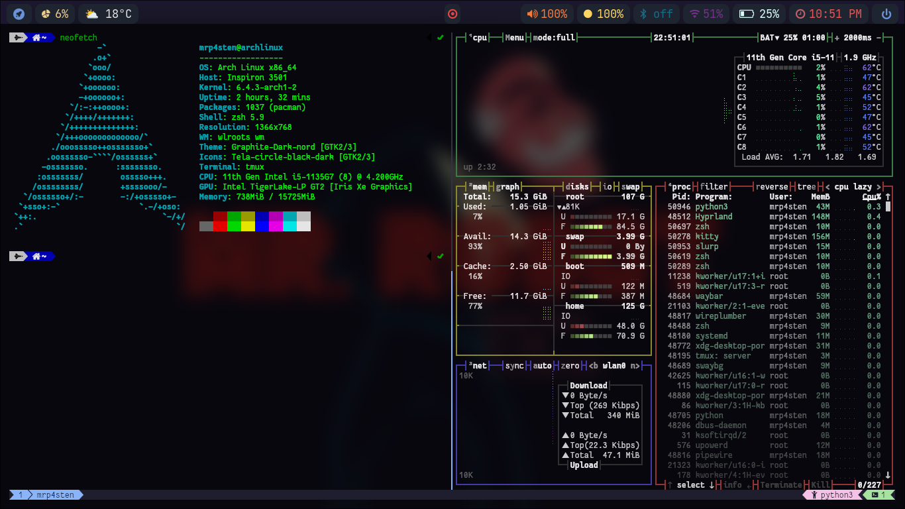
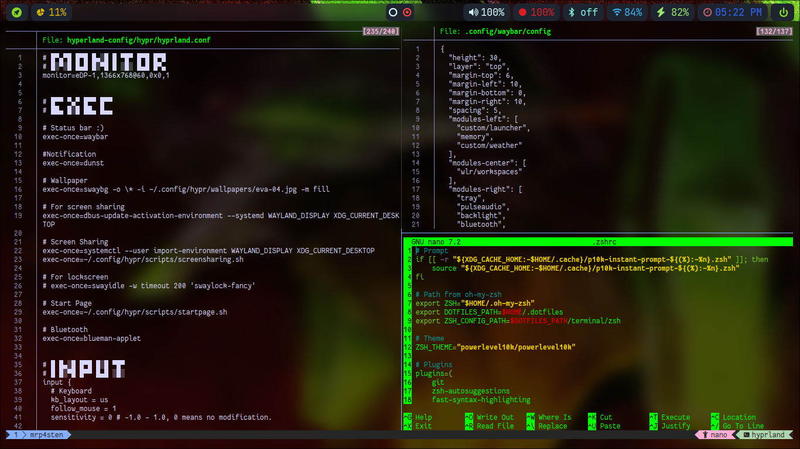
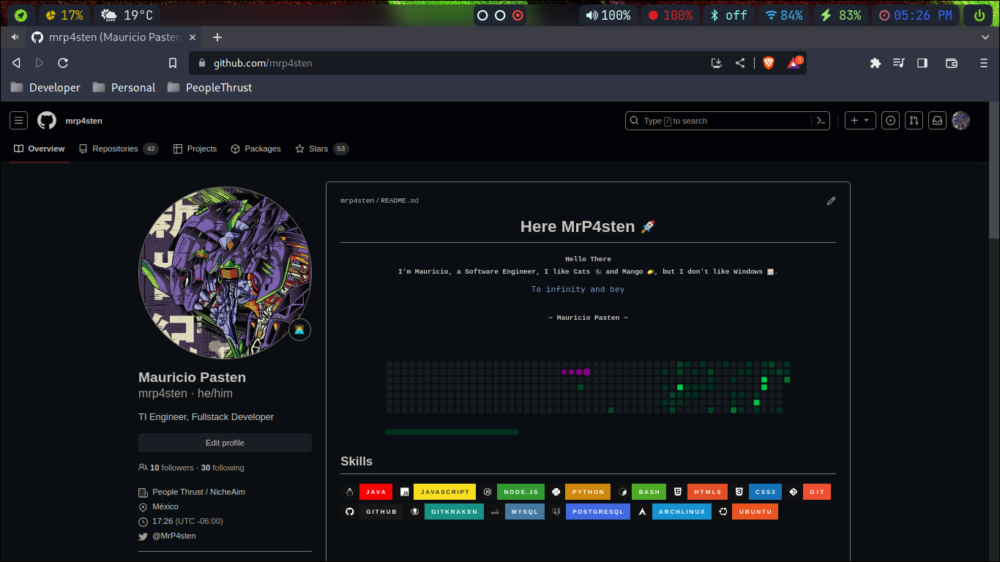

# Welcome to my Dotfiles

This dotfiles include the follow config types:

- vscode settings
- hyperland desktop environment
- terminal
  - bash
  - zsh
  - tmux
  - kitty
  - alacritty

This setup is used actually on Arch Linux but you try to use in another linux distro
How can you have my dotfiles?

> Just [R.T.F.M](https://en.wikipedia.org/wiki/RTFM) in each directory

## First Step

Im using ArchLinux Distribution so try to Install AUR Helper

- Manually

```shell
sudo pacman -S --needed base-devel
git clone https://aur.archlinux.org/paru.git && cd paru && makepkg -si && cd
```

Instead you can run the script `install_aur_helper.sh`

### Preview





