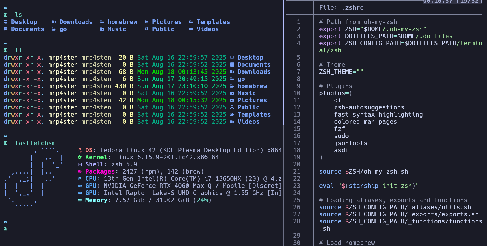

# Welcome to my Dotfiles

This dotfiles include the follow config types:

- vscode settings
- terminal
  - bash
  - kitty
  - tmux
  - zsh

This setup is used actually on Arch Linux (Manjaro) but you try to use in another linux distro
How can you have my dotfiles?

> Just [R.T.F.M](https://en.wikipedia.org/wiki/RTFM) in each directory

## First Steps

Download my custom files

```shell
cd ~/
git clone https://github.com/mrp4sten/.dotfiles.git .dotfiles
```

### Preview





#### List of my favorite applications and terminal utilities

##### Applications

- Google Chrome
- Kitty Terminal
- VisualStudioCode
- YouTube Music
- Bruno
- Postman
- Notepadqq
- Bitwarden
- Stacer
- Libreoffice
- Discord
- OBS
- Kdenlive
- JasperSoft Studio
- Thunderbird
- Timeshift
- Ulauncher

##### Terminal (zsh) Applications

- pass
- bpytop
- sdkman
- asdf
- tmux
- ranger
- ncdu
- timeshift
- (Other dev tools like jdk, npm, yarn, etc.)
