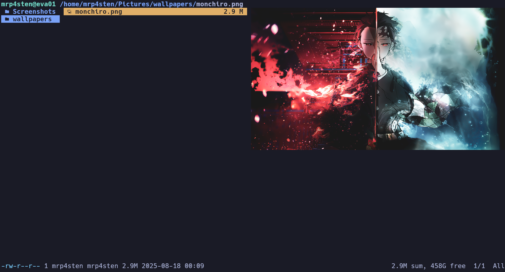
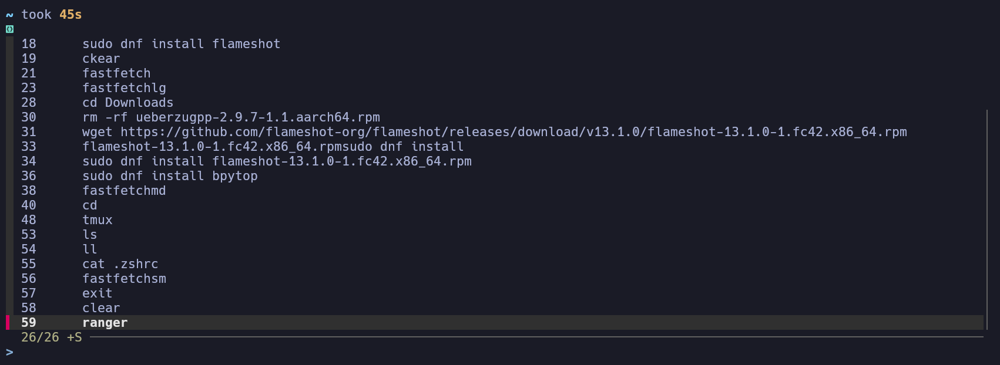
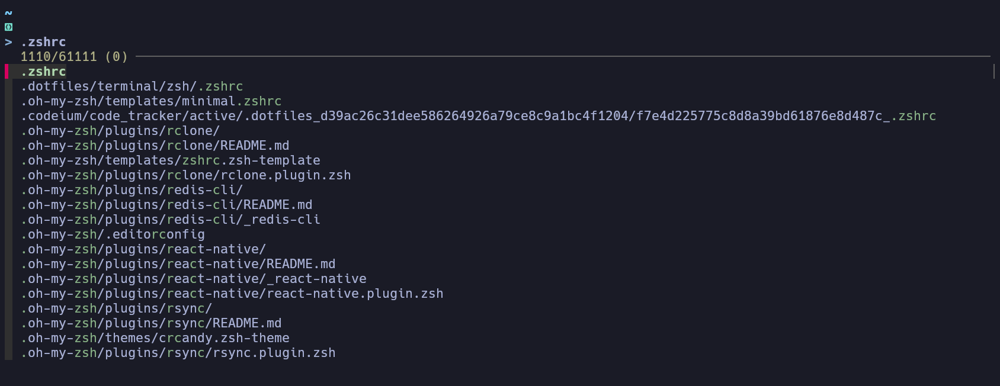

# Welcome to my Dotfiles

This dotfiles include the follow config types:

- vscode settings
- terminal
  - bash
  - kitty
  - tmux
  - zsh

This setup is used actually on Arch Linux (Manjaro) but you try to use in another linux distro
How can you have my dotfiles?

> Just [R.T.F.M](https://en.wikipedia.org/wiki/RTFM) in each directory

## First Step

Im using ArchLinux Distribution so try to Install AUR Helper

- Manually

```shell
git clone https://aur.archlinux.org/yay.git && cd yay && makepkg -si && cd
```

Instead you can run the script `install_aur_helper.sh`

### Preview






#### List of my favorite applications and terminal utilities

##### Applications

- Google Chrome
- Kitty Terminal
- VisualStudioCode
- YouTube Music
- Bruno
- Postman
- Notepadqq
- Bitwarden
- Stacer
- Libreoffice
- Discord
- OBS
- Kdenlive
- JasperSoft Studio
- Thunderbird
- Timeshift

##### Terminal (zsh) Applications

- yay (aur package manager for Arch Linux)
- pass
- task (Taskwarrior)
- bpytop
- gcloud cli
- sdkman
- asdf
- tmux
- git
- bat
- lsd
- fsf
- ranger
- ncdu
- figlet
- cowsay
- lolcat
- timeshift
- timetrap
- (Other dev tools like jdk, npm, yarn, etc.)
