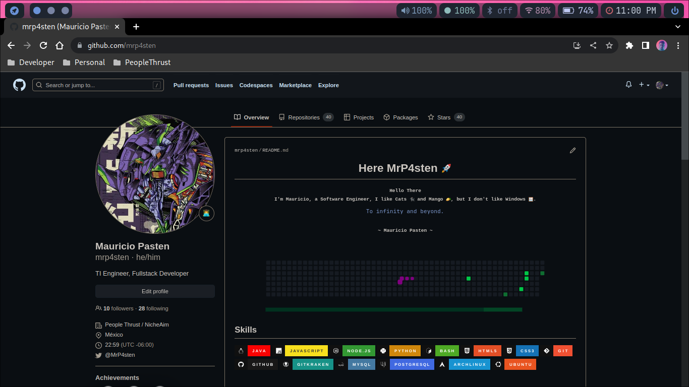
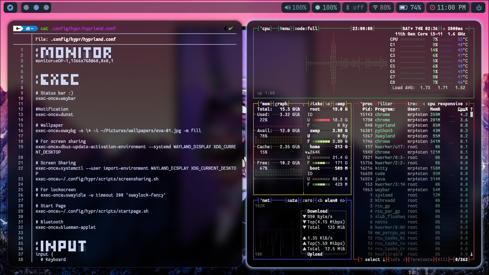
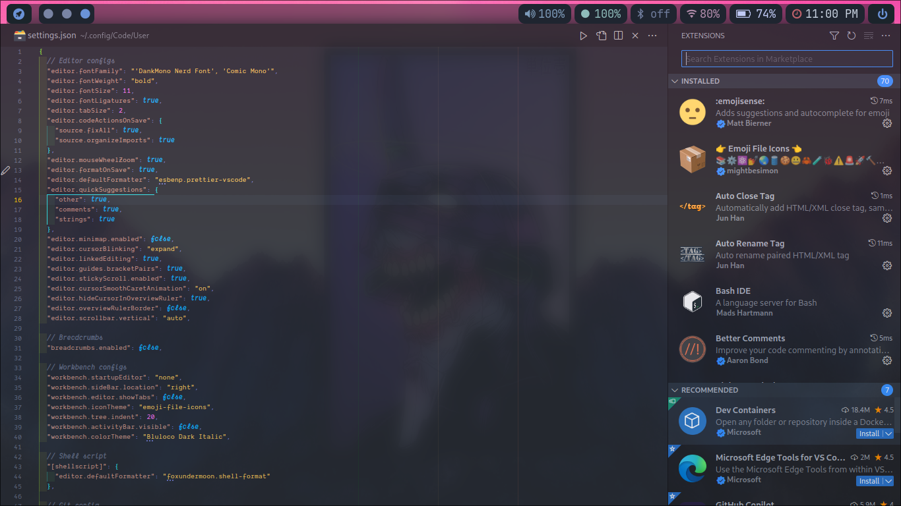

<h1 align="center"> mrp4sten 💻 config <h1>







## Installations ⬇️

### Dependencies

- Install Hyprland

```shell
paru -S hyprland-git
```

- Base set-ups

```shell
paru -S waybar-hyprland waybar-git rofi dunst kitty swaybg mugshot swaylock-effects-git\
swayidle pamixer light light-git brillo grimblast-git pavucontrol
```

- Installing Fonts

```shell
cd /usr/share/fonts
sudo wget https://github.com/ryanoasis/nerd-fonts/releases/download/v2.2.2/JetBrainsMono.zip
sudo unzip JetBrainsMono.zip
sudo rm JetBrainsMono.zip

sudo wget https://github.com/ryanoasis/nerd-fonts/releases/download/v2.3.3/Iosevka.zip
sudo unzip Iosevka.zip
sudo rm Iosevka.zip

sudo wget https://github.com/googlefonts/noto-emoji/raw/main/fonts/NotoColorEmoji.ttf
sudo wget https://github.com/microsoft/vscode-codicons/raw/main/dist/codicon.ttf
cd

paru -S ttf-font-awesome

fc-cache -fv
```

- Copy files 📁

```shell
cp -r dunst hypr rofi waybar ~/.config/
```
